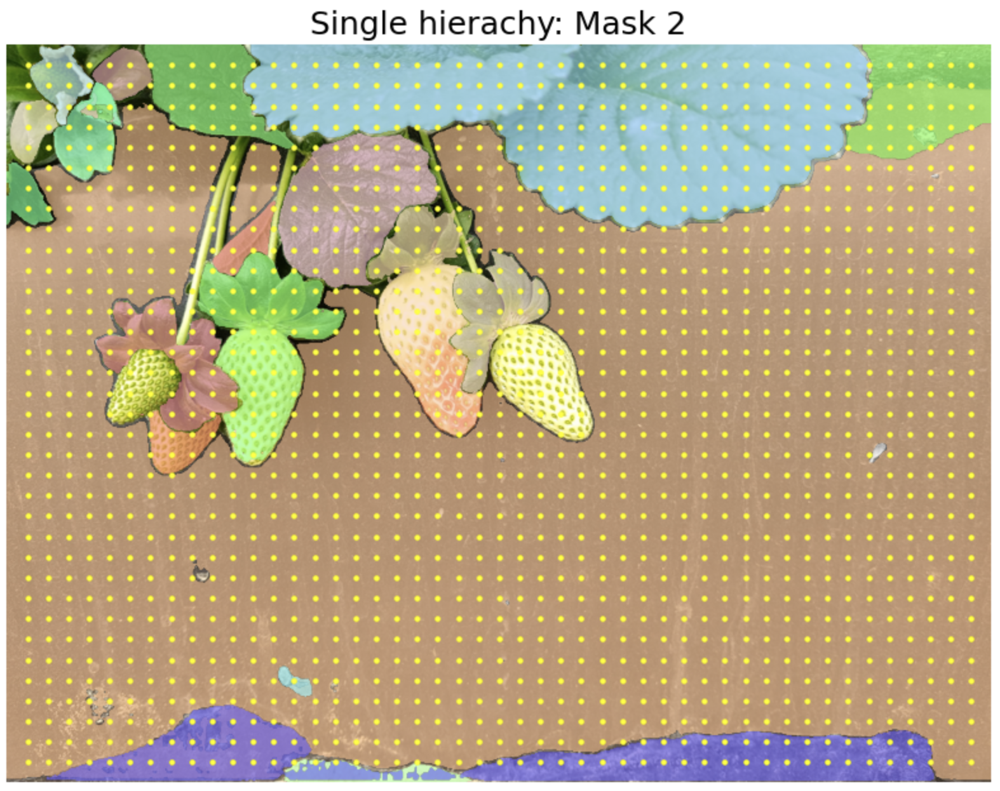
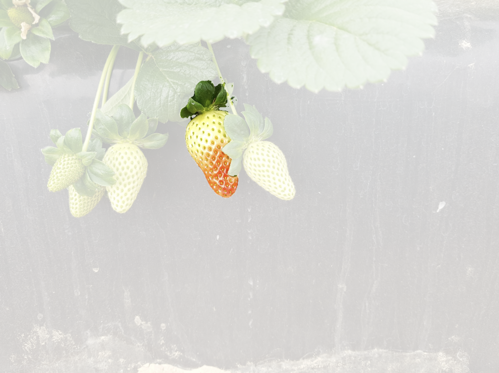
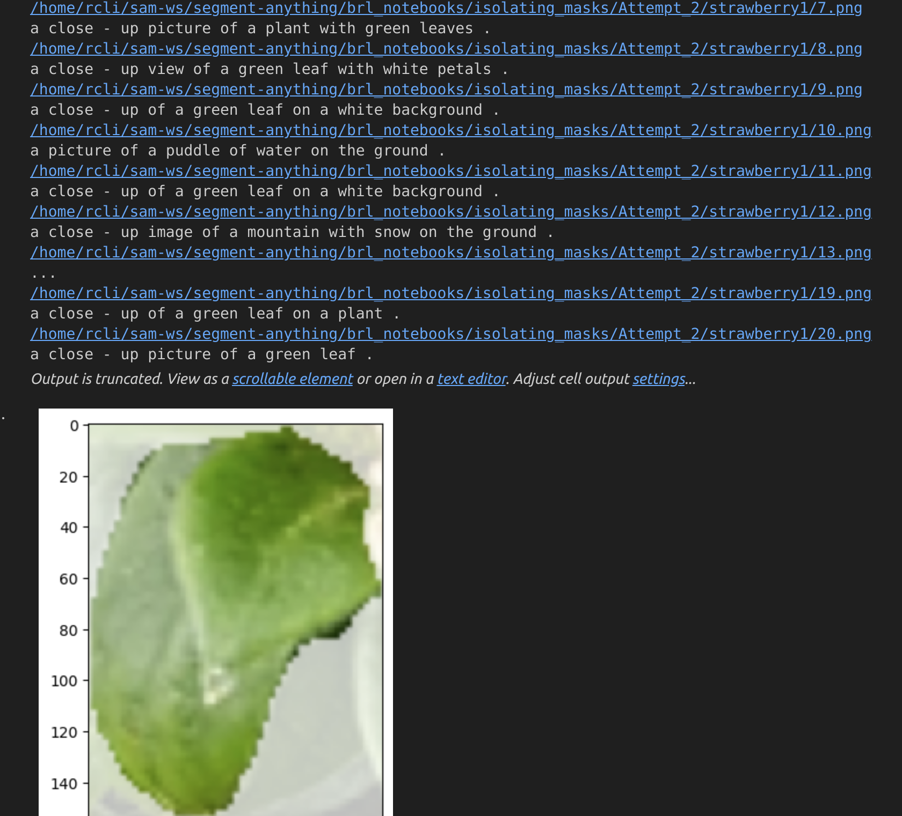

首先需要下载sam_vit_h_4b8939.pth的模型（根据SAM的教程走）

## SAM多级分割：single_level_segmentation.ipynb
打开single_level_segmentation.ipynb，根据自己存的图片修改[9]的路径：
``` image = cv2.imread('images/strawberry1.png') ```
运行程序即可得到mask1,mask2,mask3三个级别的分割效果


## isolating图片存储：isolating_objects.py
首先需要设置好读入图片和保存结果的路径,在76，77行：
```input_folder = "/home/rcli/sam-ws/segment-anything/brl_notebooks/images"```
```save_folder = "/home/rcli/sam-ws/segment-anything/brl_notebooks/isolating_masks/Attempt_2"```
根据前面多级分割的效果，修改isolating_objects.py的111，112行代码括号内数字：
```mask = masks[1] # 0-mask1, 1-mask2, 2-mask3```
```score = scores[1] # 0-mask1, 1-mask2, 2-mask3```
运行程序：
```python3 isolating_objects.py```
即可在save_folder中得到结果，这里的结果是对背景做淡化，130行中：
```mask_image[mask_data.mask == 0] = 64```
64改为0代表背景全白，改为255代表原图不变，可自行调整


## CLIP语言描述：test.ipynb
需要先根据CLIP的教程下好对应的依赖
将前面的save_folder设置为这里的file_path:
```file_path = "/home/rcli/sam-ws/segment-anything/brl_notebooks/isolating_masks/Attempt_2/strawberry1"```
如果需要对整张图片做描述，这里也需要修改：
```full_img_path = "/home/rcli/sam-ws/segment-anything/brl_notebooks/images/strawberry1.png"```
否则注释掉即可，运行该Notebook即可查看CLIP对其的语言描述



